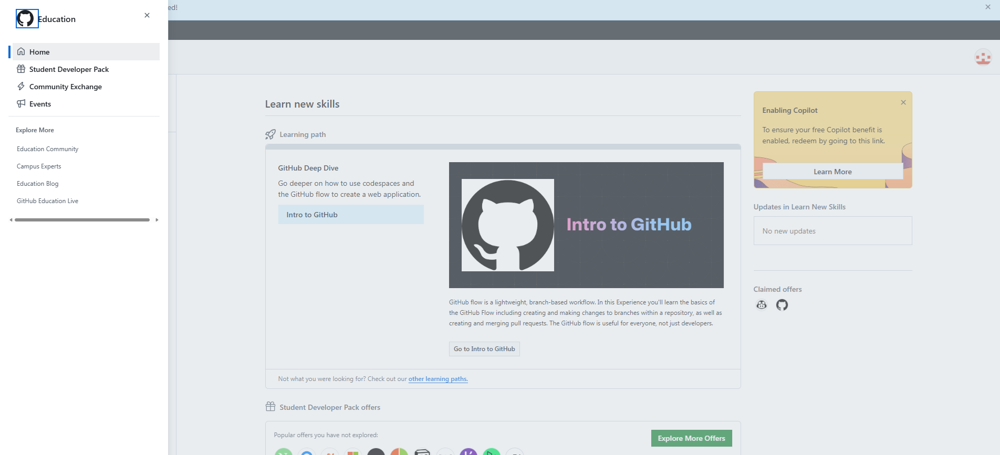

# Downloading and Installing Positron {#sec-install}

Installing Positron was straightforward. Positron is available as a free download from the Posit website at <https://positron.posit.co>. The installer is similar in size to a typical desktop application and works on Windows, macOS, and Linux.

# Positron vs. RStudio: What I Like {#sec-comparison}

After spending time with both environments, I noticed several differences worth highlighting. The table below summarizes the key comparisons.

::: panel-tabset
## Side-by-Side Comparison

| Feature | RStudio | Positron |
|------------------------|------------------------|------------------------|
| Interface style | Traditional IDE layout | VS Code-based, more modern |
| Python support | Limited (via reticulate) | Native, first-class |
| AI integration | None built-in | Multiple AI extensions available |
| Variable explorer | Environment pane | Variables pane (cleaner) |
| Console behavior | Separate pane | Integrated terminal-style |
| Extension ecosystem | RStudio add-ins only | Full VS Code extension library |
| Quarto support | Yes | Yes (more tightly integrated) |

## What I Prefer in Positron

There are a few things that immediately stood out to me when switching from RStudio:

**The layout feels less cluttered.** RStudio has four fixed panes and the arrangement can feel rigid once you have many tabs open. Positron is built on the VS Code shell, which means panels are more flexible and can be rearranged or hidden based on what you are actually working on.

**The Variables pane is nicer.** In RStudio, the Environment tab shows objects but the display is fairly basic. Positron's Variables pane gives a cleaner summary of each object including type, shape, and a quick preview, which saves time when you are debugging a data wrangling step and want to quickly check what a dataframe looks like without printing it.

**Python and R in the same place.** This is the biggest practical win. Before Positron, working in both R and Python meant switching between RStudio and VS Code or Jupyter. Positron handles both natively, with separate consoles but the same project structure.

## What RStudio Still Does Better

To be fair, RStudio is not obsolete:

- The **Help pane** in RStudio feels more integrated. Looking up `?dplyr::filter` opens inline in the IDE. In Positron this works too but feels slightly less seamless.
- **Package management** through RStudio's Packages tab is more beginner-friendly than managing packages through the terminal in Positron.
- If you are working exclusively in R and have no need for Python or AI tools, RStudio is perfectly sufficient and has a lower learning curve.
:::

------------------------------------------------------------------------

# AI Tools Inside Positron {#sec-ai}

## Overview of AI Options {#sec-ai-overview}

One of the most interesting aspects of Positron is how it inherits the full VS Code extension ecosystem, which means a wide range of AI coding assistants can be installed directly. Below is a summary of the options available.

::: {.callout-note title="Free vs. paid AI tools in Positron"}
Some AI tools are completely free (GitHub Copilot for students, Ollama for local models), while others require a paid subscription (GitHub Copilot Pro, Cursor AI). It is worth exploring the free options first before committing to anything paid.
:::

The main AI tools you can use inside Positron:

- **GitHub Copilot** — inline code suggestions as you type, plus a chat panel for asking questions. Free for students with a GitHub Education account.
- **Ollama** — runs local open-source models (like Llama 3 or Mistral) entirely on your machine. Free but requires decent hardware.
- **Continue.dev** — an open-source AI coding assistant extension that works with multiple model backends including Ollama and OpenAI.
- **Copilot Chat** — a conversational interface where you can ask questions about your code, explain errors, or request refactoring suggestions.
- **Codeium** — a free alternative to Copilot that provides inline suggestions without needing a GitHub education account.

## Which AI Tools I Set Up {#sec-ai-setup}

I set up **GitHub Copilot** as my primary tool since it is free for students and the most widely used. I also briefly tested **Codeium** as a backup for cases where Copilot suggestions felt too generic.

For Copilot, the setup steps were:

1.  Install the **GitHub Copilot** extension from the Extensions panel in Positron
2.  Sign in with a GitHub account that has an active Education subscription
3.  Enable inline suggestions in the settings (they are on by default after sign-in)
4.  Optionally install **GitHub Copilot Chat** as a separate extension for the conversational panel

## GitHub Copilot Education Account {#sec-copilot-edu}

Below is a screenshot confirming access to the GitHub Education program. the dashboard shows the Student Developer Pack is active, claimed offers are visible in the bottom right corner, and there is a prompt to enable the free Copilot benefit.

## Is Copilot Helpful or Distracting? {#sec-copilot-review}

::: {.callout-important title="My honest take on Copilot"}
GitHub Copilot is genuinely useful, but it requires a certain mindset to get the most out of it. If you accept every suggestion without reading it, you will end up with code that runs but does not do what you intended.
:::

**Where I found it helpful:**

- Writing repetitive boilerplate code, like setting up a ggplot with labels and a theme. Copilot often completes the whole block after I type the first line.
- Remembering function argument names. Instead of stopping to look up whether the argument is `na.rm` or `remove.na`, Copilot usually suggests the correct one in context.

**Where it can be distracting:**

- When I am still thinking through the logic of what I want to write, seeing a suggestion pop up pulls my attention before I have fully formed the idea. Sometimes dismissing suggestions takes more mental energy than just typing.

Overall I would say it is helpful more often than it is distracting, especially for tasks that are mostly mechanical.

------------------------------------------------------------------------

[**https://yourusername.github.io/intro-positron-reflection/W07-Reflection-Essay-Intro-Positron.html**](https://yourusername.github.io/intro-positron-reflection/W07-Reflection-Essay-Intro-Positron.html)
